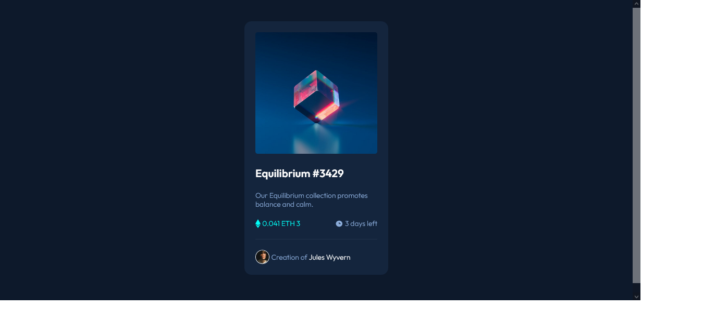

# Frontend Mentor - NFT preview card component solution

This is a solution to the [NFT preview card component challenge on Frontend Mentor](https://www.frontendmentor.io/challenges/nft-preview-card-component-SbdUL_w0U). Frontend Mentor challenges help you improve your coding skills by building realistic projects.

## Table of contents

- [Frontend Mentor - NFT preview card component solution](#frontend-mentor---nft-preview-card-component-solution)
  - [Table of contents](#table-of-contents)
  - [Overview](#overview)
    - [The challenge](#the-challenge)
    - [Screenshot](#screenshot)
    - [Links](#links)
  - [My process](#my-process)
    - [Built with](#built-with)
    - [What I learned](#what-i-learned)
    - [Continued development](#continued-development)
    - [Useful resources](#useful-resources)
  - [Author](#author)
  - [Acknowledgments](#acknowledgments)

## Overview

### The challenge

Users should be able to:

- View the optimal layout depending on their device's screen size
- See hover states for interactive elements

### Screenshot

### Links

- Solution URL: [Solution repo](https://github.com/Psypher1/fem-nft-card-component)
- Live Site URL: [live solution](https://psypher1.github.io/fem-nft-card-component/)

## My process

### Built with

- Semantic HTML5 markup
- CSS custom properties (Open props to provide guidance for some sizes)
- Flexbox
- CSS Grid
- Mobile-first workflow

### What I learned

- Positioning and layout - the order to lay things in to not cause problem later.

### Continued development

- Getting a better undestanding of overlay on hover.

### Useful resources

- [Open Props](https://open-props.style/) - This simplified having to figure out spacing and size values.
- [Conquering Responsive Layouts](https://courses.kevinpowell.co/conquering-responsive-layouts) - This course is a must for anyone serious about understanding CSS.

## Author

- Website - [James Midzi](https://mrmidzi.netlify.app)
- Frontend Mentor - [@Psypher1](https://www.frontendmentor.io/profile/Psypher1)
- Twitter - [@Psypher1](https://www.twitter.com/Psypher1)

**Note: Delete this note and add/remove/edit lines above based on what links you'd like to share.**

## Acknowledgments

The internet. knowledge from various people aided me in this challenge.
